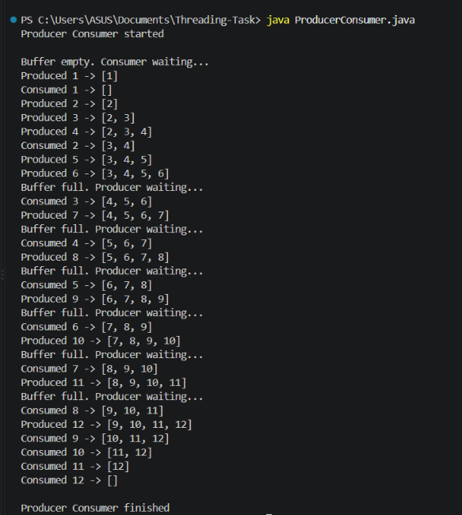
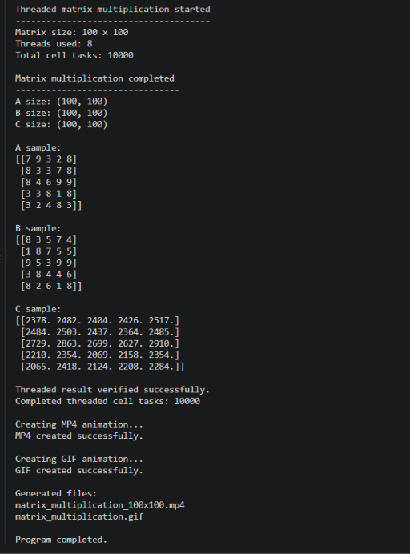

# 🧵 OS_Task1 – Multithreading Assignment

> **Implementation of the Producer-Consumer problem using Java threads and 100 × 100 matrix multiplication using Python threads and TensorFlow with animated visualization.**

---

## 📌 Overview

This repository contains two programs:

1. **Producer-Consumer Problem using Java Threads**
2. **100 × 100 Matrix Multiplication using Threads + TensorFlow with Animation**

---

## 📂 Files in this Repository

| File | Description |
|------|-------------|
| `ProducerConsumer.java` | Producer-Consumer problem using Java threads |
| `producer_consumer_output.png` | Screenshot of Producer-Consumer output |
| `matrix_multiplication.py` | 100 × 100 matrix multiplication using Python threads and TensorFlow |
| `matrix_multiplication_output.png` | Screenshot of threaded matrix multiplication output |
| `matrix_multiplication_100x100.mp4` | MP4 animation of matrix multiplication |
| `matrix_multiplication.gif` | GIF animation of matrix multiplication |
| `README.md` | Documentation for both programs |

---

# 1️⃣ Program 1 – Producer-Consumer Problem

## 📌 Description

The Producer-Consumer problem is implemented using **Java threads** with a shared circular buffer.

- The **Producer** adds items into the buffer.
- The **Consumer** removes items from the buffer.
- If the buffer is full, the Producer waits.
- If the buffer is empty, the Consumer waits.
- Synchronization is used to safely access the shared buffer.

The program uses a buffer size of **4** and produces and consumes **12 items**.

---

## 🔹 Concepts Used

- Java Threads
- Multithreading
- Synchronization
- Shared Buffer
- Circular Buffer
- `wait()`
- `notifyAll()`
- `join()`

---

## ⚙️ Approach

A fixed-size integer array is used as a circular buffer.

The program maintains:

- `in` → next insertion position
- `out` → next removal position
- `count` → number of items currently present in the buffer

A common lock object is used for synchronization.

When the buffer is full, the Producer waits.

When the buffer is empty, the Consumer waits.

After an item is produced or consumed, `notifyAll()` is used to wake the waiting thread.

---

## ▶️ How to Run Program 1

Compile the Java program:

```bash
javac ProducerConsumer.java
```

Run the program:

```bash
java ProducerConsumer
```

---

## 🖥️ Sample Output

```text
Producer Consumer started

Buffer empty. Consumer waiting...

Produced 1 -> [1]
Consumed 1 -> []

Produced 2 -> [2]
Produced 3 -> [2, 3]
Produced 4 -> [2, 3, 4]

Produced 6 -> [3, 4, 5, 6]
Buffer full. Producer waiting...

Consumed 3 -> [4, 5, 6]

...

Producer Consumer finished
```

---

## 📷 Output Screenshot



---

# 2️⃣ Program 2 – 100 × 100 Matrix Multiplication using Threads + TensorFlow

## 📌 Description

The second program performs multiplication of two matrices of size **100 × 100** using Python threads and TensorFlow.

The matrices are:

```text
Matrix A = 100 × 100
Matrix B = 100 × 100
Result Matrix C = 100 × 100
```

The operation is:

```text
Matrix A × Matrix B = Matrix C
```

The program uses `ThreadPoolExecutor` for threaded execution and TensorFlow for the numerical calculations.

---

## 🔹 Concepts and Technologies Used

- Python
- ThreadPoolExecutor
- Multithreading
- TensorFlow
- NumPy
- Matrix Multiplication
- Matplotlib
- Animation
- FFmpeg

---

## ⚙️ Approach

Two random **100 × 100 matrices** are generated using NumPy and converted into TensorFlow tensors.

The result matrix contains:

**100 × 100 = 10,000 cells**

A `ThreadPoolExecutor` with multiple worker threads is used to perform the matrix multiplication.

Each result cell `C[i][j]` is submitted as a separate threaded task.

For every result cell:

- one row from Matrix A is selected
- one column from Matrix B is selected
- TensorFlow performs element-wise multiplication
- `tf.reduce_sum()` adds the multiplied values

Conceptually:

```text
C[i][j] =
A[i][0] × B[0][j]
+
A[i][1] × B[1][j]
+
...
+
A[i][99] × B[99][j]
```

Since the result matrix contains **100 × 100 cells**, the program creates **10,000 threaded cell tasks**.

The order in which the threaded tasks finish is recorded and later used for the animation.

A normal TensorFlow `tf.matmul()` result is also calculated at the end only to verify that the threaded result is correct.

---

## 🎬 Animation

The animation displays three matrices:

- **Matrix A** – a horizontal indicator shows the current row.
- **Matrix B** – a vertical indicator shows the current column.
- **Matrix C** – the result cells are filled progressively.

The animation uses the recorded completion order of the threaded cell calculations.

This visually demonstrates:

> **Row of Matrix A × Column of Matrix B → Result Cell in Matrix C**

---

## 🎥 Animation Output

The program generates:

```text
matrix_multiplication_100x100.mp4
matrix_multiplication.gif
```

### GIF Preview


---

## ▶️ Installation for Program 2

Python **3.10** is used.

### Create a virtual environment

```bash
py -3.10 -m venv .venv
```

### Activate the virtual environment

```bash
.\.venv\Scripts\Activate.ps1
```

### Install the required libraries

```bash
pip install tensorflow numpy matplotlib imageio-ffmpeg pillow
```

---

## ▶️ How to Run Program 2

```bash
python matrix_multiplication.py
```

---

## 🖥️ Sample Output

```text
Threaded matrix multiplication started
--------------------------------------
Matrix size: 100 x 100
Threads used: 8
Total cell tasks: 10000

Matrix multiplication completed

A size: (100, 100)
B size: (100, 100)
C size: (100, 100)

Threaded result verified successfully.
Completed threaded cell tasks: 10000

Creating MP4 animation...
MP4 created successfully.

Creating GIF animation...
GIF created successfully.

Program completed.
```

---

## 📷 Output Screenshot



---

## ✅ Verification

The threaded result is compared with a normal TensorFlow `tf.matmul()` result.

If both results match, the program displays:

```text
Threaded result verified successfully.
```

This confirms that the threaded matrix multiplication has produced the correct result.

---

# 🛠️ Technologies Used

## Program 1

- Java
- Java Threads
- Synchronization
- Circular Buffer

## Program 2

- Python
- ThreadPoolExecutor
- Multithreading
- TensorFlow
- NumPy
- Matplotlib
- FFmpeg
- Animation

---

# ✅ Conclusion

The first program demonstrates **thread synchronization using the Producer-Consumer problem in Java**.

The second program performs **100 × 100 matrix multiplication using Python threads and TensorFlow**.

Each result cell is calculated as a separate threaded task, and the animation shows the result matrix being constructed according to the recorded threaded computation.
